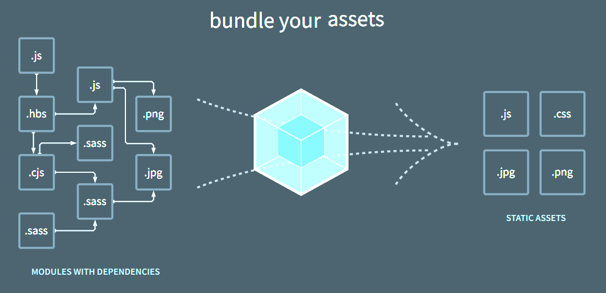

# 플러그인

## 1. 플러그인의 역할

- 로더는 파일 단위로 처리하는 반면 플러그인은 번들된 결과물을 처리한다. 번들된 자바스크립트를 난독화 한다거나 특정 텍스트를 추출하는 용도로 사용한다.

## 2. 커스텀 플러그인 만들기

- 로더는 함수로 정의
- 플러그인은 클래스로 정의

```js
// my-webpack-plugin.js
class MyWebpackPlugin {
  apply(compiler) {
    compiler.hooks.done.tap("My Plugin", (stats) => {
      console.log("MyPlugin: done");
    });

    // compiler.plugin() 함수로 후처리한다
    compiler.plugin("emit", (compilation, callback) => {
      const source = compilation.assets["main.js"].source(); // 번들링된 (output에 있는) 결과물에 접근할 수 있다.(main.js를 가져온다.)
      console.log(source);

      compilation.assets["main.js"].source = () => {
        const banner = [
          "/**",
          " * 처리결과",
          " * Build Date: 2023-11-27",
          "*/",
        ].join("\n");
        return banner + "\n\n" + source;
      };

      callback();
    });
  }
}

module.exports = MyWebpackPlugin;
```

```js
// webpack.config.js
const MyWebpackPlugin = require("./my-webpack-plugin");

module.exports = {
    ...
  plugins: [new MyWebpackPlugin()],
};

```

- 로더는 여러개 파일에 대해 각각 실행되는데 플러그인은 번들 파일에 대해서 딱 한번 실행된다.



- 번들은 파일들을 묶어서 하나로 만들어 주는 것
- 플러그인은 만들어진 output 파일의 후처리해주는 것
  - 플러그인을 직접 만드는 경우는 거의 없다.
